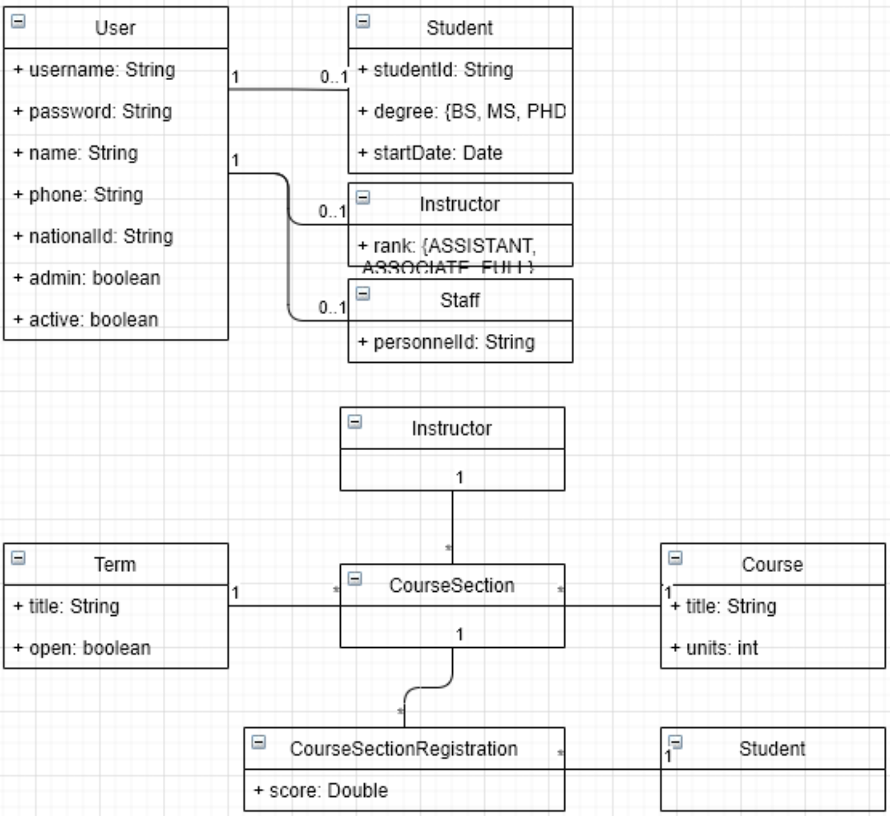

# University education system

in this project, a university education system in a very simple way with the help of technologies such as Java, Maven, Spring Boot/Data/Web, JPA, JUnit, Mockito, ...<br><br>
develops This project only includes the server side of the mentioned system and provides web services. In this document, the term LCRUD or its sub phrases are abbreviations respectively List, Create, Read, Update, Delete
<br>
Basic design of entities
The basic design of entities is as follows. Note that this figure is drawn to convey the concept, and you may decide to make changes or additions to it during the course of the project.
<br><br>

<br><br>
#### Description of users:
• We have four types of users: admin, student, professor and employee.
<br>
• Users have some common information (such as username and password) and some specific information (such as student number that is specific to students).
<br>
• A user can be both a student and a professor.
<br><br>
#### Lesson description:
• We have a number of semesters and a number of courses.
<br>
• In each semester, each professor can offer a number of lessons, which we call a section.
<br>
• Each student can register in a number of study groups.
<br><br>
### Required web services
In most of the web services of the system (except for registration and login), it is necessary to use a suitable authentication mechanism, which means that the client should put a suitable header in its request and the server will realize the identity by using it. become a user
<br>
Tip: Search for authentication and authorization keywords along with spring.
<br>
#### User registration
Anyone can register by providing username, password, name, phone number and national code. All fields are mandatory. Username, phone number and national code must be unique. If successful, the personal user will be created passively.
<br>
Stored users passwords in a hashed form in the database.
<br>
#### User Authentication
Anyone can log in to the system by providing a username and password. If it is correct, the server must provide the necessary information to the client to put in the header in the next requests so that the server can authenticate him.
<br>
#### Staff management
Admin can register another person as an employee in the system by providing the username and personnel number, and in this case, that user will be activated.
Explaining that the employee must have registered himself first and then tell the administrator the username so that he can continue the registration. Other LRUD operations must also be enabled by the administrator.
#### Teacher registration
Similar to employee registration, with the consideration that CUD operations can be performed by admin and employees and LR operations can be performed by all users.
<br>
#### Student registration
Similar to teacher registration.
<br>
#### Term definition
In the form of LCRUD, LR can be done by all users and CUD can only be done by admin and employees.
<br>
#### Course definition
In the form of LCRUD, LR can be done by all users and CUD can only be done by admin and employees.
<br>
#### CourseSection definition
In the form of LCRUD, LR can be done by all users and C can only be done by the master. UD operations can be performed by admin, employees and also by the professor who himself defined this group. Operation D is conditional on the fact that no student is enrolled in this course group.
<br>
#### Registration in the study group
It is done by the student and by presenting the class ID.
<br>
#### Get the list of class students
It can be done by the professor, administrator and staff in such a way that the list of registered students will be presented after receiving the ID of the course group. For each student, student ID, name, student number and grade are provided.
<br>
#### Grading students
It can be done by the professor, in this way, by receiving the class ID, student ID and grade, the grade is registered.
<br>
Grading the list of students, in such a way that a group ID and a list of student IDs and grades are received.
<br>
#### View term grades
It can be done by the student, in such a way that upon receiving the semester ID, the grade point average of the semester as well as the list of student groups in that semester along with each grade will be provided. For each group, group ID, course name, number of units, professor's name and grade should be provided.
<br>
#### View academic summary
It can be done by the student, in such a way that it provides the total grade point average of the student as well as the list of semesters along with the grade point average of each semester. For each semester, the semester ID, semester title and semester average should be provided.
<br>
### Automated test
• Write a unit test to calculate the student's GPA in one semester. • Write an integration test for this scenario: the professor defines a course group, the student enrolls in that group,
<br>
The professor grades the student, the student sees the semester grades correctly (hint: you can use MockMvc if you wish)
## API Reference
after building dependencies and running these are some sample endpoints to test

#### Get all users:

```http
curl -X GET -w " %{http_code}\n" "http://127.0.0.1:8080/all-users"
```

| Parameter           | Type  | Description              |
|:--------------------|:------|:-------------------------|
| `list of all users` | `GET` | No authentication needed |

#### Register a new custom user:

```http
curl -X POST -H "Content-Type: application/json" -d @/absolute/path/to/costumUser.json -w " %{http_code}\n" "http://127.0.0.1:8080/register"
```

| Parameter                           | Type   | Description                      |
|:------------------------------------|:-------|:---------------------------------|
| `customUser json registration file` | `POST` | No authentication needed         |

#### Register a new custom user:

```http
curl -X POST -H "Content-Type: application/json" -d @/absolute/path/to/userAuth.json -w " %{http_code}\n" "http://127.0.0.1:8080/authenticate"
```

| Parameter                             | Type   | Description                                |
|:--------------------------------------|:-------|:-------------------------------------------|
| `customUser json authentication file` | `POST` | **Required** correct username and password |

| Parameter              | Type  | Description                                |
|:-----------------------|:------|:-------------------------------------------|
| `authentication token` | `GET` | **Required** correct username and password |
#### Register a new custom user:

```http
curl -X POST -H "Content-Type: application/json" -H "Authorization: Bearer <access_token>" -d @/absolute/path/to/instructor.json -w " %{http_code}\n" "http://127.0.0.1:8080/authorize/instructor?username=ali"
```

| Parameter                             | Type   | Description                                |
|:--------------------------------------|:-------|:-------------------------------------------|
| `customUser json authentication file` | `POST` | **Required** correct username and password |

